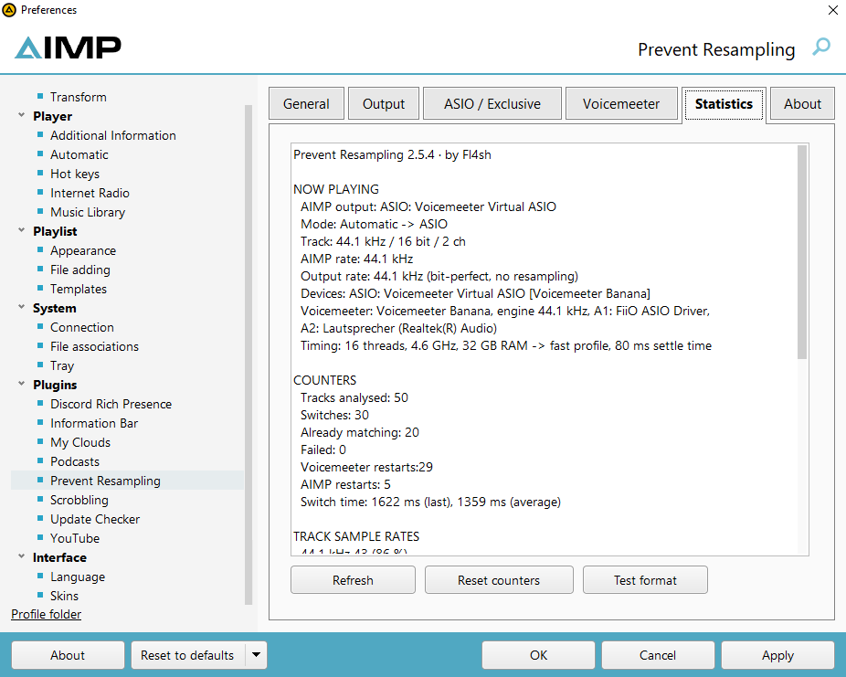
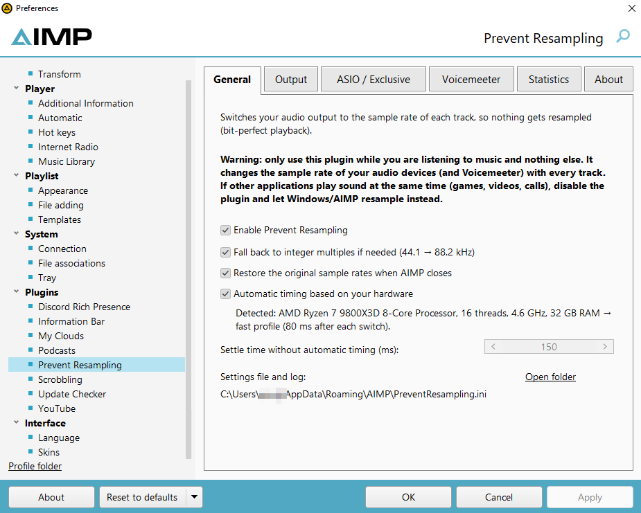
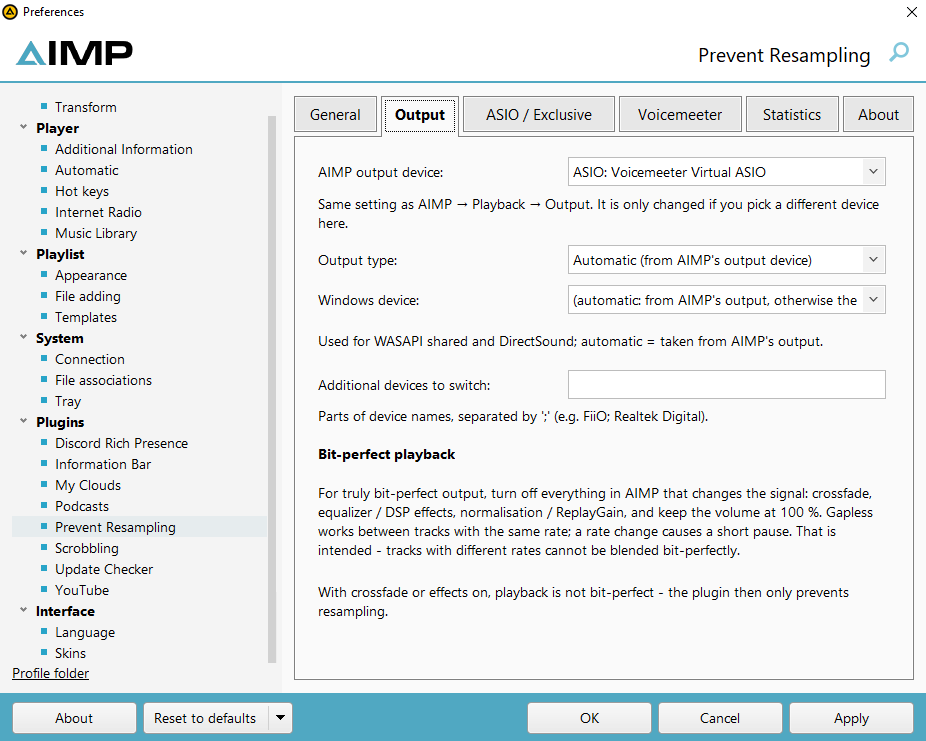
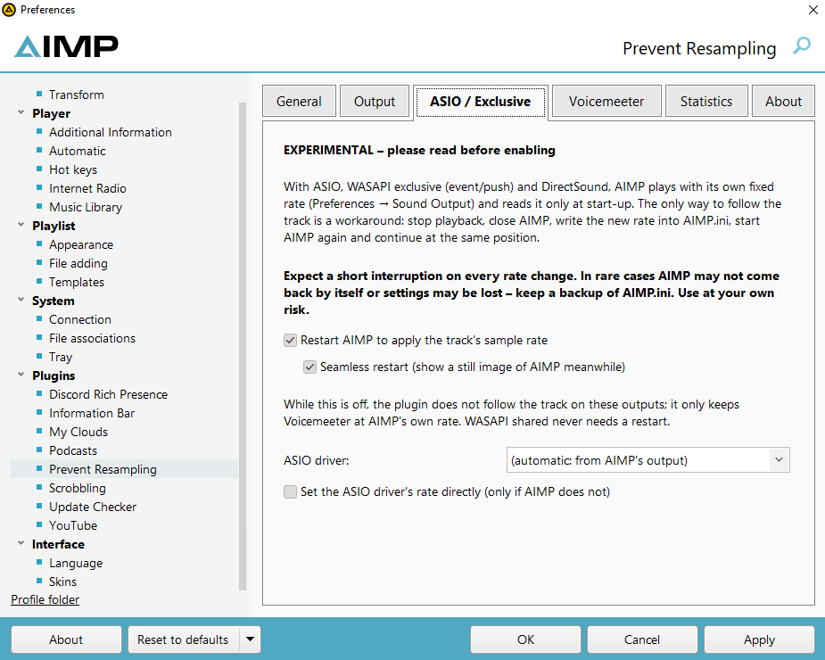
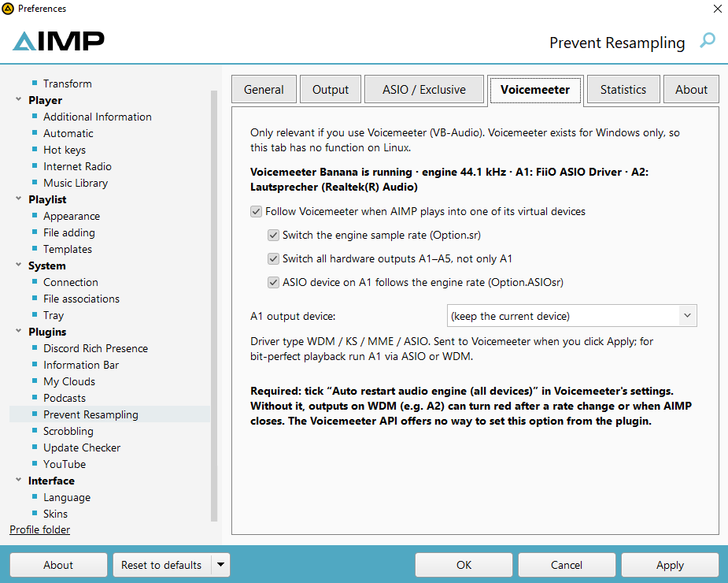
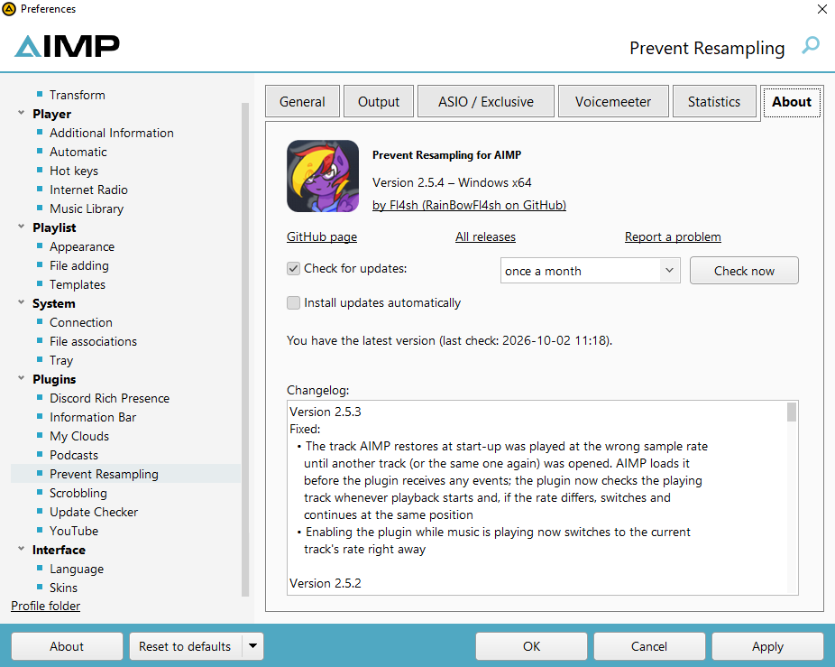

# Prevent Resampling for AIMP

**Prevent Resampling** is an AIMP plugin by **Fl4sh** that switches your audio output to the **sample rate of every track**. A 44.1 kHz album plays at 44.1 kHz, a 96 kHz album at 96 kHz: Windows, Voicemeeter and your DAC follow the music, and nothing gets resampled on the way.

It works with **WASAPI shared**, **Voicemeeter** (engine rate and the Windows format of all hardware outputs A1–A5) and, with an optional experimental AIMP restart, **ASIO**, **WASAPI exclusive** and **DirectSound** on Windows, plus **PipeWire** on Linux (there it currently keeps PipeWire at AIMP's own rate — see [Known limitations](#known-limitations)). Everything is set up directly in AIMP under *Preferences → Plugins → Prevent Resampling*. Supported: **AIMP 4.70, 5 and 6** (Windows 32/64 bit, AIMP 6 also on Linux).

<p align="center">
  
</p>

> [!WARNING]
> **The plugin is disabled after installation.** Enable it under *Preferences → Plugins → Prevent Resampling → General*.
>
> **Only use it while you are listening to music and nothing else.** The plugin changes the sample rate of your audio devices (and of Voicemeeter) with every track. If other applications play sound at the same time (games, videos, voice calls), they are affected too: short dropouts, devices re-opening, sometimes the wrong pitch. In that case disable the plugin and let Windows/AIMP resample — that is what resampling is for.

## Contents

- [Installation](#installation)
- [First steps](#first-steps)
- [The settings page](#the-settings-page) — [General](#general) · [Output](#output) · [ASIO / Exclusive](#asio--exclusive) · [Voicemeeter](#voicemeeter) · [Statistics](#statistics) · [About](#about)
- [How it works](#how-it-works)
- [Bit-perfect playback — what it needs](#bit-perfect-playback--what-it-needs)
- [Known limitations](#known-limitations) · [Troubleshooting](#troubleshooting)
- [Building](#building) · [Tests](#tests) · [Changelog](CHANGELOG.md)

## Installation

**Supported AIMP versions**

| AIMP | Windows 32 bit | Windows 64 bit | Linux (native) | Tested with |
|---|---|---|---|---|
| **6.x** | ✔ | ✔ | ✔ (see [limitations](#known-limitations)) | 6.00 Beta 7 (build 3088) |
| **5.x** | ✔ | ✔ | – | 5.40 (build 2727) |
| **4.x** (4.70 or newer) | ✔ | – (AIMP 4 is 32 bit only) | – | 4.70 (build 2254) |
| 3.x | ✘ | – | – | 3.60: its plugin interface has no settings pages and no thread service |

All functions work in AIMP 4, 5 and 6: switching, Voicemeeter, restoring on exit, the AIMP restart for ASIO / exclusive / DirectSound, updates and the settings page. The only difference in AIMP 4: the plugin cannot change AIMP's output device (see [Output](#output)).

**Windows:** 7, 8.1, 10 and 11 (32 and 64 bit). The plugin uses no Windows functions newer than Windows 7, and every AIMP version above was tested with Windows 7, 8, 8.1, 10 and 11 emulated by Wine (AIMP 6 itself does not start under Wine in the Windows 10/11 mode, with or without the plugin).

1. Download **`PreventResampling-<version>.aimppack`** from the [releases page](https://github.com/RainBowFl4sh/AIMP-No-Resmapling/releases). One package for all platforms: Windows 32-bit, Windows 64-bit and Linux.
2. Open it with AIMP (double-click it, or drag it onto the AIMP window) and confirm the installation.
3. **Restart AIMP.** AIMP only loads new plugins at start-up.

> [!IMPORTANT]
> **Always install and update with the `.aimppack`.** Copying the DLL by hand over an installed version fails while AIMP is running, because Windows does not let anyone overwrite a loaded DLL. The package contains the 32-bit and 64-bit Windows DLLs and the Linux library; AIMP picks the right one.

If you really want to install by hand, each release also has `…-win32.zip`, `…-win64.zip` and `…-linux-x64.zip` — pick the one that matches your AIMP (32 or 64 bit; *Help → About* in AIMP shows it). Each ZIP contains the folder `PreventResampling` with the plugin file directly inside. Close AIMP, extract the ZIP into AIMP's plugin folder and tick the plugin under *Preferences → Plugins* after the next start (AIMP does not enable plugins copied by hand):

| Platform | ZIP | Result |
|---|---|---|
| Windows 32 bit | `…-win32.zip` | `AIMP\Plugins\PreventResampling\PreventResampling.dll` |
| Windows 64 bit | `…-win64.zip` | `AIMP\Plugins\PreventResampling\PreventResampling.dll` |
| Linux 64 bit (AIMP 6) | `…-linux-x64.zip` | `~/.config/AIMP/Plugins/PreventResampling/PreventResampling.so` |

The plugin file must be **directly** in the `PreventResampling` folder — AIMP does not look into sub-folders such as `x64` (that layout only exists inside the `.aimppack`). On Windows you can also use the plugin folder in your profile, `%APPDATA%\AIMP\Plugins`, which is where AIMP itself installs `.aimppack` files.

**Updates** come the same way: the *About* tab finds a new release on GitHub, downloads the `.aimppack`, checks its SHA-256 checksum and opens it in AIMP. After you confirm the installation, the plugin notices the new files and **restarts AIMP by itself**, continuing the current track at the same position.

## First steps

1. Open *Preferences → Plugins → Prevent Resampling* (or the gear button next to the plugin in the plugin list).
2. **General:** read the warning and tick *Enable Prevent Resampling*.
3. **Output:** leave *Output type* on *Automatic*. The plugin reads AIMP's output device and knows what to switch.
4. **Voicemeeter users:** tick *Auto restart audio engine (all devices)* in Voicemeeter's own settings (see [Voicemeeter](#voicemeeter)).
5. **ASIO / WASAPI exclusive / DirectSound users:** these outputs only follow the track with the experimental AIMP restart. Read the [ASIO / Exclusive](#asio--exclusive) section before you enable it.
6. Play some music and watch the *Statistics* tab: *Output rate … (bit-perfect, no resampling)* means it works.

## The settings page

The page uses AIMP's own controls, so it follows your skin and works on Windows and Linux. Its layout matches the author's Discord Rich Presence plugin.

### General



- **Enable Prevent Resampling**: off after installation.
- **Fall back to integer multiples**: if a device cannot play a rate, the plugin picks a multiple of the same family (44.1 → 88.2 → 176.4 kHz, 48 → 96 → 192 kHz) instead of giving up.
- **Restore the original sample rates when AIMP closes**: Windows devices and Voicemeeter go back to the rates they had before the session. A restart by the plugin itself (ASIO / exclusive) does *not* restore, so the restarted AIMP does not have to switch again.
- **Automatic timing based on your hardware**: the plugin detects CPU threads, clock and RAM and picks how long to wait after a switch (see [Timing](#timing-and-hardware-detection)). Turn it off to set a fixed settle time.
- **Settings file and log**: *Open folder* opens the folder with `PreventResampling.ini` and `PreventResampling.log`.

### Output



- **AIMP output device**: the same setting as *Playback → Output* in AIMP. It is only changed if you pick a different device here. In AIMP 4 the list is greyed out and only shows AIMP's current output — choose the device in AIMP's own settings there.
- **Output type**: *Automatic* (recommended) detects WASAPI shared, WASAPI exclusive, ASIO or DirectSound from AIMP's output. You can force a type if detection fails.
- **Windows device**: the device whose Windows format is switched for WASAPI shared and DirectSound. *Automatic* takes it from AIMP's output, otherwise the Windows default device.
- **Additional devices to switch**: parts of device names separated by `;` (e.g. `FiiO; Realtek Digital`), switched together with the main device.
- **Bit-perfect playback**: what you have to switch off in AIMP for a truly bit-perfect signal — see [below](#bit-perfect-playback--what-it-needs).

### ASIO / Exclusive



> [!CAUTION]
> **This option is a workaround. It is off by default, and you use it at your own risk.**
> With ASIO, WASAPI exclusive (event / push) and DirectSound, AIMP plays with its **own fixed rate** (`AIMPSoundOut\DeviceFreq` in `AIMP.ini`). AIMP reads it **only at start-up** and gives plugins no way to change it. The only way to follow the track is to **close AIMP, change its configuration file and start it again**, on every rate change. Expect a short interruption each time. In rare cases AIMP may not come back by itself or settings may be lost. **Keep a backup of `AIMP.ini`.**

What happens with **Restart AIMP to apply the track's sample rate** turned on:

1. The plugin stops playback and remembers the track and the position.
2. It starts a small helper (`rundll32 PreventResampling.dll,RestartAimp …`) and closes AIMP. Windows and Voicemeeter keep the new rate.
3. The helper waits until AIMP has exited, writes the new rate into `AIMP.ini` (keeping the file's encoding) and starts AIMP again.
4. The track continues at the same position. A safety check prevents restart loops if AIMP does not take the new rate.

**Seamless restart**: right before AIMP closes, the helper takes a still image of AIMP's windows and shows it in exactly the same place, so AIMP seems to stay open. The image fades out as soon as the new AIMP window is on screen. Audio still pauses during the restart, and the taskbar button and tray icon disappear for a moment.

**With the option off** the plugin does not follow the track on these outputs. If AIMP plays into Voicemeeter, the plugin only keeps the Voicemeeter engine at AIMP's own rate so the pitch is always right. WASAPI shared never needs a restart, because Windows handles the rate there.

**ASIO driver** and **Set the ASIO driver's rate directly** are only needed if AIMP does not set the driver's rate itself.

### Voicemeeter



Only relevant if you use **Voicemeeter** (Standard, Banana or Potato; VB-Audio, Windows only). When AIMP plays into one of Voicemeeter's virtual devices (VAIO, AUX, VAIO3 or *Voicemeeter Virtual ASIO*), the plugin:

- sets the **engine sample rate** (`Option.sr`) to the track's rate (44.1 / 48 / 88.2 / 96 / 176.4 / 192 kHz),
- lets the **ASIO device on A1** follow that rate (`Option.ASIOsr`),
- switches the **Windows format of all hardware outputs A1–A5** that have a device (A1–A2 Standard, A1–A3 Banana, A1–A5 Potato), so every DAC runs at the track's rate. Voicemeeter often names devices differently than Windows (A1 "FiiO ASIO Driver" ↔ "Speakers (FiiO KA11)"); the plugin matches them by name,
- restarts the engine only when its rate or a device format really changed, and waits until it runs at the new rate.

> [!IMPORTANT]
> Tick **"Auto restart audio engine (all devices)"** in Voicemeeter's settings. Without it, outputs on WDM (e.g. A2) can turn red after a rate change. Voicemeeter's API has no parameter for this option, so the plugin cannot set it for you.

The **A1 output device** list (WDM / KS / MME / ASIO) comes straight from Voicemeeter; the choice is sent to Voicemeeter when you click *Apply*. The plugin never starts Voicemeeter. If it is not installed or not running, this part stays inactive; if Voicemeeter is started while AIMP runs, the plugin notices it within a few seconds and switches the current track. On Linux the tab shows all options greyed out with a *Linux detected – this tab is disabled* note; support for Linux mixers such as Pulsemeeter may follow.

### Statistics


- **Now playing**: AIMP output, detected mode, track (rate / bits / channels), AIMP's own rate, the output rate with a *bit-perfect* or *integer multiple* note, the device chain, Voicemeeter status and the timing profile.
- **Counters**: analysed tracks, switches, already matching, failed, Voicemeeter and AIMP restarts, switch time (last / average).
- **Track sample rates**: how your library is distributed (e.g. 44.1 kHz: 43 (86 %)).
- **Recent events**: the latest log lines.
- **Test format** switches the Windows default format back and forth once and writes every step to the log, which helps with troubleshooting.

### About



Version and platform, links to this repository (*GitHub page*, *All releases*, *Report a problem*), the **update check** (at every AIMP start, once a day / week / month, or off; *Check now*; *Install updates automatically*, once per version) and the complete changelog with the installed version on top. Updates are downloaded through AIMP's own HTTP client (AIMP's proxy settings apply) and only installed after the SHA-256 checksum matches.

## How it works

1. When a track starts playing, the plugin reads its sample rate, bit depth, channels and codec. A track that AIMP restored from the last session is checked as soon as you press play.
2. It detects the output type from AIMP's output device:

| Output | What happens | AIMP restart needed? |
|---|---|---|
| **WASAPI shared** | The Windows "default format" of the device is set to the track's rate. | No |
| **WASAPI exclusive** (event / push) | AIMP opens the device itself, but with its own fixed rate. | **Yes** (optional, experimental) |
| **ASIO** | AIMP drives the ASIO driver with its own fixed rate. With *Voicemeeter Virtual ASIO* the Voicemeeter engine is switched as well. | **Yes** (optional, experimental) |
| **DirectSound** | The Windows default format is switched, but AIMP keeps its own fixed rate. | **Yes** (optional, experimental) |
| **PipeWire** (Linux) | AIMP for Linux resamples every track to its own fixed rate (*Sound Output → Parameters*). The PipeWire graph rate is set to **that** rate with `pw-metadata -n settings 0 clock.force-rate <Hz>`, so PipeWire does not resample a second time. It is released when AIMP closes. | To follow each track: yes (planned for Linux) |
| **ALSA direct** (Linux) | Nothing is changed; AIMP opens the device with its own fixed rate. | To follow each track: yes (planned for Linux) |

3. It picks a rate that **all** devices in the chain support, or an integer multiple of the same family.
4. If everything already matches, **nothing** happens: albums with one rate play without any gap.
5. Otherwise it pauses briefly, switches (hardware first, the device AIMP plays into last), restarts Voicemeeter if needed and continues the track **at the same position**. Music that you paused or stopped is never started by the plugin.

### Timing and hardware detection

| Profile | Typical hardware | Settle time | Voicemeeter polling |
|---|---|---|---|
| **Fast** | ≥ 8 threads, ≥ 2.8 GHz, ≥ 8 GB RAM | ~80 ms | starts after 30 ms |
| **Normal** | everything in between | ~160 ms | starts after 60 ms |
| **Conservative** | ≤ 2 threads, < 1.8 GHz or < 4 GB RAM | ~320 ms | starts after 120 ms |

## Bit-perfect playback — what it needs

The plugin keeps the output at the track's sample rate. For a truly bit-perfect signal, AIMP must not change the samples either:

- switch off **crossfade**, the **equalizer** and **DSP effects**, **normalisation / ReplayGain**, and keep AIMP's **volume at 100 %**;
- **gapless** playback keeps working between tracks with the same rate. When the rate changes there is a short pause, because the device has to be reopened. That is intended: tracks with different rates cannot be blended bit-perfectly.

With crossfade or effects on, playback is **not** bit-perfect, and the plugin then only prevents resampling. Voicemeeter works internally with 32-bit float, so strictly bit-perfect is only the direct path (exclusive / ASIO without Voicemeeter); with Voicemeeter there is at least no resampling.

## Settings file and log

| Platform | Settings | Log |
|---|---|---|
| Windows | `%APPDATA%\AIMP\PreventResampling.ini` | `%APPDATA%\AIMP\PreventResampling.log` |
| Linux | `~/.config/AIMP/PreventResampling.ini` | AIMP profile folder |

The settings file is created with all defaults on the first start (plugin **disabled**, AIMP restart **off**). Its sections are `[PreventResampling]` (options), `[Statistics]` (counters), `[Updates]` (last update check) and, only for a moment during a restart by the plugin, `[Session]`. Delete the file to reset everything. The log shows start-up, detected hardware and devices, chosen rates and every switch, including the restart helper's steps.

## Known limitations

- The Windows device format can only be changed through the **undocumented** `IPolicyConfig` interface. Windows updates may break it.
- In shared mode and with Voicemeeter the track is paused briefly on a rate change, because AIMP opens the device before the plugin knows the rate.
- ASIO / WASAPI exclusive / DirectSound only follow the track with the experimental restart option.
- ASIO: most drivers allow only one client. *Set the ASIO driver's rate directly* only works if AIMP releases the driver when stopping.
- Linux: AIMP for Linux (6.00 Beta 7) always resamples to its own fixed rate, like on Windows. Until the AIMP restart is available on Linux, the plugin only keeps PipeWire at AIMP's rate, which avoids a second resampling step; playback is not yet bit-perfect for tracks with other rates. Only PipeWire is switched (plain PulseAudio is not).

## Troubleshooting

- **Plugin does not appear in AIMP:** check that you use AIMP 4.70 or newer. Install it with the `.aimppack` and restart AIMP. When copying by hand, the plugin file has to be directly in `Plugins/PreventResampling/` (no `x64` sub-folder), the ZIP has to match your AIMP (32 or 64 bit), and the plugin has to be ticked under *Preferences → Plugins*.
- **Installing over an older version fails:** use the `.aimppack`, not the DLL. AIMP is running and holds the old DLL.
- **Nothing happens:** the plugin is off after installation — enable it on the *General* tab. Then check the *Statistics* tab or the log. With ASIO / WASAPI exclusive / DirectSound the restart option must be enabled.
- **A Voicemeeter output turns red:** tick *Auto restart audio engine (all devices)* in Voicemeeter.
- **"No suitable rate":** the driver reports no support for the rate (and no multiple) in exclusive mode.
- **AIMP does not come back after a restart:** start AIMP yourself. The log shows each step of the restart helper. Disable the restart option if it happens again.
- **Something else:** [report a problem](https://github.com/RainBowFl4sh/AIMP-No-Resmapling/issues) and attach `PreventResampling.log`.

## Building

The AIMP SDK headers (AIMP 6.00 Beta 7) are in `sdk/`. To use another SDK copy, pass `-DAIMP_SDK_DIR=<SDK>/Sources/Cpp`.

**Windows** (Visual Studio 2022 + CMake + Git):

```bat
build.bat              :: builds 32 and 64 bit into dist\PreventResampling
build.bat "C:\aimp_sdk\Sources\Cpp"   :: use your own SDK copy
```

**Linux** (native plugin and Windows DLLs via MinGW):

```sh
sudo apt install cmake g++ pkg-config libcairo2-dev git   # cairo: headers only, required by the SDK
./build.sh            # Linux .so + test
./build.sh all        # additionally Windows 32/64 bit (package mingw-w64)
```

**AIMP package:** `tools/make_aimppack.py --x86 <dll> --x64 <dll> --linux <so>` builds the `.aimppack` and its `.sha256`.

**GitHub Actions:** every push builds MSVC x64/Win32 (with an export check), Linux x64 with the mock test, MinGW x64/x86 and tests the 64-bit DLL under Wine. Pushing a tag `v<version>` (matching `project(... VERSION ...)` in `CMakeLists.txt`) publishes a GitHub release with the `.aimppack`, its `.sha256` and the matching section of `CHANGELOG.md` — that is what the update check finds.

## Tests

`tests/MockHost.cpp` is a minimal AIMP stand-in (with the UI mock `tests/mock_ui.h` from the Discord Rich Presence plugin). It loads the plugin, "plays" tracks, and checks the defaults, PipeWire calls, configuration, statistics, the restart helper, the update check (including the restart after an update and a failed check), AIMP 4 without the output property, and a clean shutdown.

`tests/fakevm/FakeVoicemeeterRemote.c` is a stand-in for `VoicemeeterRemote(64).dll` that simulates Voicemeeter Banana and logs every call (`running=0` in `C:\vmfake.ini` simulates a Voicemeeter that is not started yet) — used to test the Voicemeeter chain in real AIMP builds under Wine (build with MinGW and `-shared -Wl,--kill-at`, register it like the real Voicemeeter under `HKLM\SOFTWARE\Microsoft\Windows\CurrentVersion\Uninstall\VB:Voicemeeter {17359A74-1236-5467}`). It also builds the settings page and checks its layout; `tests/render_layout.py <layout.txt> <folder>` draws that layout as one PNG per tab.

```sh
cmake -S . -B build -DAR_BUILD_TESTS=ON && cmake --build build && ctest --test-dir build --output-on-failure
```

## License

Not decided yet. The AIMP SDK in `sdk/` is © Artem Izmaylov and subject to AIMP's license.
